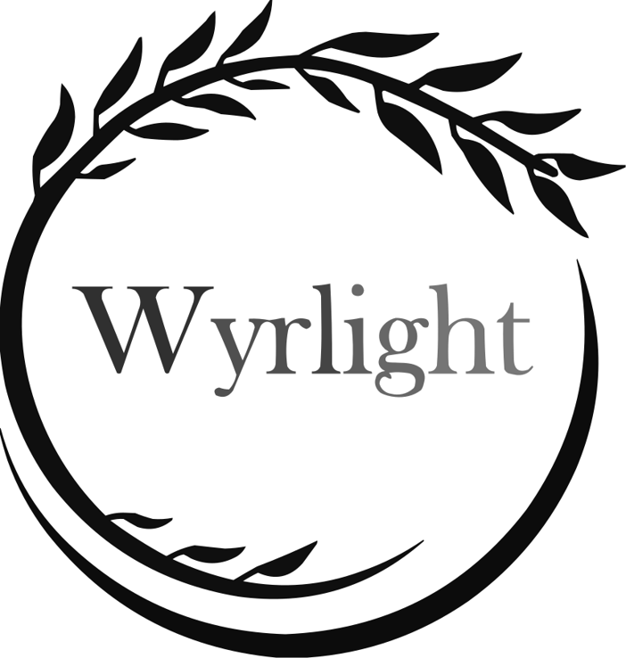
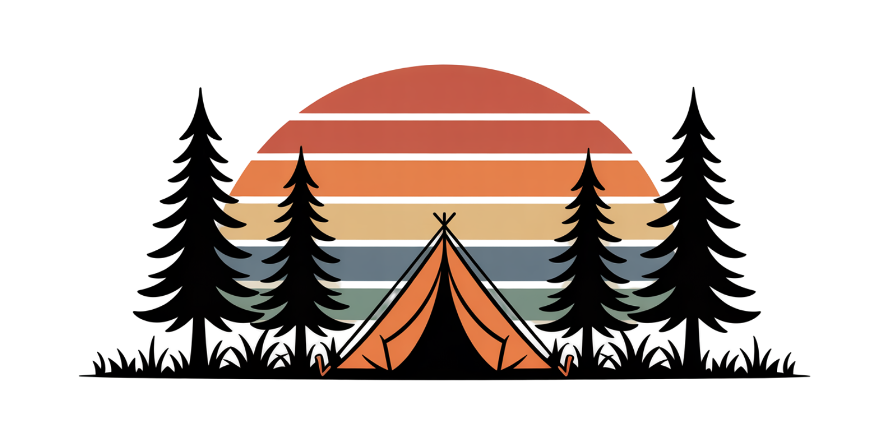

  <h1>Wyrlight is a minimalist design studio focused on vector graphics and print-on-demand apparel.</h1>

   

  

  <h2>Minimalist vector graphics & apparel design studio</h2>

  
<i>Inspired by Nordic minimalism, focusing on clarity, balance and intentional simplicity.</i>

  

      
      
      
      
      
  

---

### Licensing
All design assets and files in this repository are provided under the **MIT License**. See the [LICENSE](LICENSE) file for details.

---

### ✦ Core Focus

Wyrlight combines minimalist visual design with structured vector workflows:

* **Digital Brand Identity** – Clean, Nordic-inspired, long-term consistent visual system.
* **Vector Illustration** – Original SVG-based graphics optimized for web and print.
* **Print-on-Demand Apparel** – Minimalist artwork designed for scalable product use.
* **Visual Storytelling** – Simple forms, strong composition, intentional design language.

---

### 📁 Portfolio Overview

Wyrlight produces minimalist vector graphics, Nordic-inspired illustrations and print-on-demand apparel artwork.

---

### Links

- **Main Site** — Minimalist design studio  
  [https://wyrlight.com](https://wyrlight.com)

- **Portfolio** — Visual concepts & experiments  
  https://wyrlight.com/Portfolio/

- **CodePen** — Interactive design experiments  
  [https://codepen.io/WyrlightStudio](https://codepen.io/WyrlightStudio)

---

### ✦ Current Focus

  
   
  <em>Exploring minimalist vector systems and Nordic-inspired visual language for upcoming collections.</em>

---

### Documentation
- [SVG Concepts](SVG-Concept.md)

---

  Wyrlight is a long-term minimalist design system focused on clarity, structure and consistency across digital and physical media.
   
  <small><em>Est. 2024 | Nordic-inspired design system</em></small>

